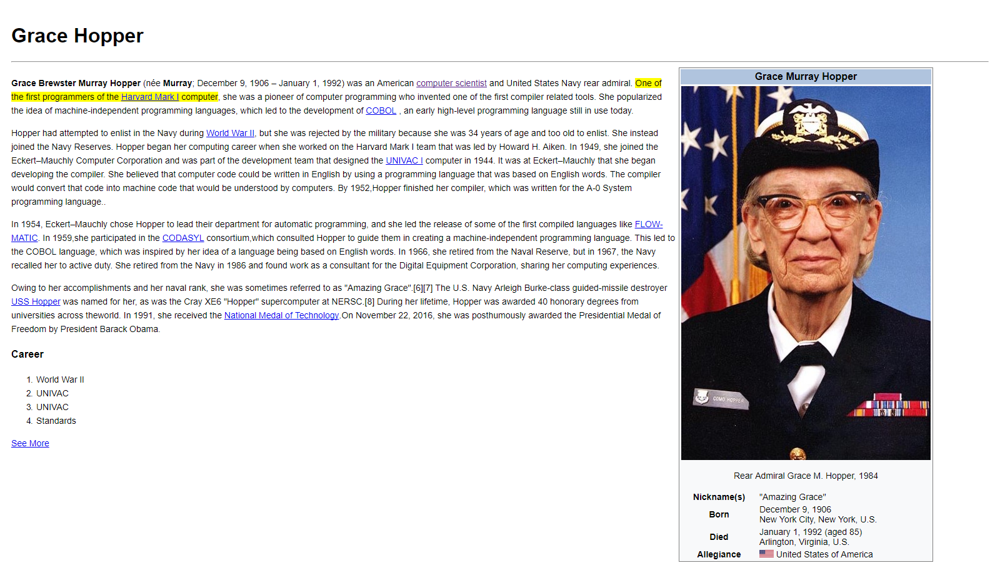

## **Grace Hopper**
### **¿Qué es?**
#### Es un programa que muestra una copia de la pagina web de Grace Hopper en Wikipedia, en el cual utilizamos diversas etiquetas de Html para crear la estructura y diversas propiedades en CSS para obtener un semejanza mayor con respecto al diseño de la página.

### **Detalles del Repositorio**
- Se encuentra un archivo index.html en el cual se encuentra toda la estructura del programa como el encabezado, la sección de la biografía y la tabla que muestra algunos datos de Grace Hopper.
- Se encuentra un archivo information.html el cual se reirecciona desde el archivo index.html. Este archibo muestra información adicional de Grace Hopper.
- La carpeta css contiene el archivo main.css el cual muestra todos lo estilos utilizados para el diseño del proyecto.
- La carpeta assets/img contiene las imágenes que utilizamos en nuestro proyecto como la fotografía de Grace Hopper.
- La carpeta assets/docs contiene la imágen que utilizamos en nuestro README.md

